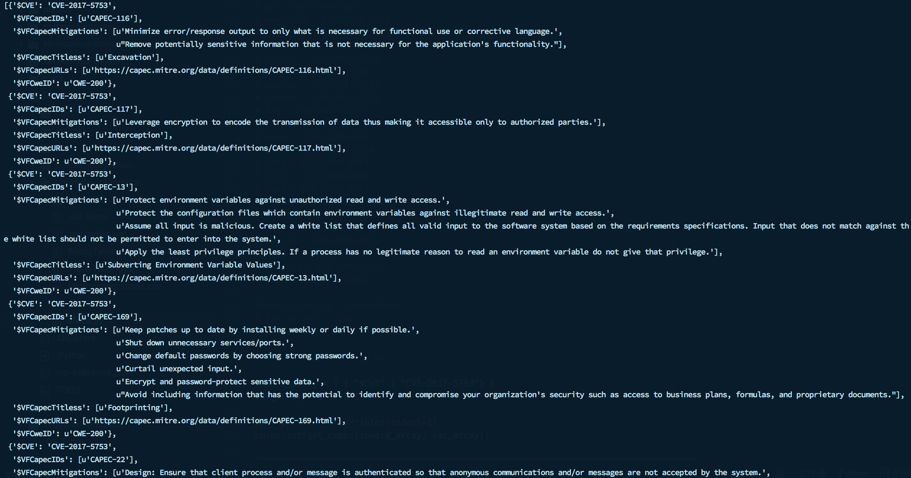
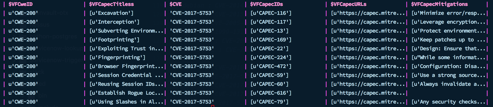

# PyPretty-Table
A python script that takes in dictionaries and spits them out in visually organized table.

## Sample Output
#### Pretty Print
Python comes with a neat pretty print function that helps you print almost anything. A simple pprint on a list of dictionaries returns the following data.



See how impossible it would be to find a needle in this haystack? When you can't visualize, it's harder to work on it. Always a good idea to visualize data. So use PyPretty-Table. When the same data is passed to the tablePrinter function this is how it looks.



Saved my sanity.

## How to Install

Quite simple really. All of the code is in the `PrettyTable.py` file. If you wish you could just copy paste it directly.

###### Download the PrettyTable.py file to your project folder

```
wget -O PrettyTable.py "https://raw.githubusercontent.com/advaitsaravade/PyPretty-Table/master/PrettyTable.py"
```

###### Import the file into your Python script
```
from PrettyTable import tablePrinter
```

###### Call the function
```
listOfDict = [ { "Name":"Advait", "Website": "link.org" } , { "Name":"Alice" } ]
tablePrinter(listOfDict)
```
